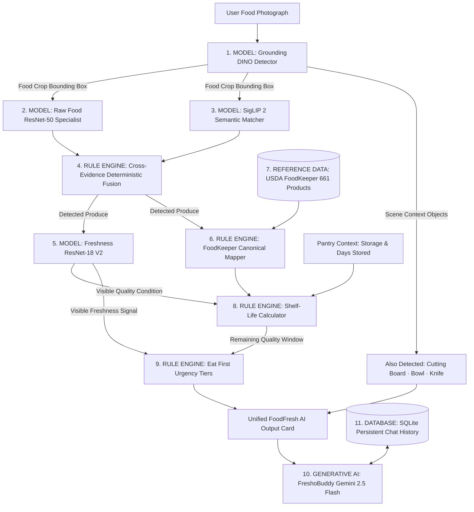

# FoodFresh AI — Current Model and Data Architecture

**Date:** September 26, 2026  
**System:** FoodFresh AI Master Vision & Quality Intelligence Platform  
**Status:** Operational — Pretrained Hybrid Inference, AgriFreshNET Fine-Tuned Freshness V2, USDA FoodKeeper Shelf-Life, Deterministic Eat First, and Google Gemini FreshoBuddy AI

---

## 1. Architectural Taxonomy: Strict Separation of Foundations

To ensure scientific integrity and eliminate ambiguity, the FoodFresh AI platform strictly categorizes every system component into five distinct foundational archetypes:

---

## 2. Foundational Matrix

| Category | Component Name | Technical Implementation | Source / Artifact Path | Purpose & Boundaries |
| :--- | :--- | :--- | :--- | :--- |
| **MODEL** | **Grounding DINO Base** | Transformer Zero-Shot Detector | `models/pretrained/grounding_dino_base` | Open-vocabulary localization of food items and scene context objects. |
| **MODEL** | **SigLIP 2 Base** | Vision-Language Contrastive Transformer | `models/pretrained/siglip2` | Zero-shot semantic identification against 111 produce items. |
| **MODEL** | **Raw Food ResNet-50** | Deep Convolutional Specialist | `models/pretrained/raw_food_resnet50` | Fine-grained classification of raw unprocessed culinary ingredients. |
| **MODEL** | **Freshness ResNet-18 V2** | Fine-Tuned ResNet-18 + ConcatPool | `models/trained/freshness_model_v2.pth` | Visible surface degradation estimator (Fresh, Slightly Spoiled, Rotten). |
| **DATASET** | **AgriFreshNET V2** | 14,160 Produce Images (8 commodities) | `data/processed/freshness_v2/` | Leakage-safe grouped dataset for real-world freshness stages. |
| **DATASET** | **Fruits-360** | 100x100 Multi-Angle Produce | `data/raw/fruits-360-100x100-main/` | Baseline visual variety benchmark across angles and cultivars. |
| **REFERENCE DATA** | **USDA FoodKeeper** | 661 Products across 25 Categories | `data/raw/foodkeeper/FoodKeeper.json` | Authoritative empirical storage reference for pantry, fridge, and freezer. |
| **RULE ENGINE** | **Decision Fusion** | Strict Cross-Evidence Logic | `ml/hybrid_vision/hybrid_pipeline.py` | Resolves conflicting model logits; gates low-confidence classifications. |
| **RULE ENGINE** | **Canonical Mapper** | Deterministic Produce Alias Table | `backend/app/services/shelf_life_service.py` | Maps colloquial food queries to canonical FoodKeeper IDs (e.g. Chilli $\rightarrow$ Hot peppers). |
| **RULE ENGINE** | **Eat First Priority** | 4-Tier Consumption Logic | `backend/app/services/eat_first_service.py` | Assigns deterministic urgency tiers (`VERY_HIGH`, `HIGH`, `MEDIUM`, `LOW`). |
| **GENERATIVE AI** | **FreshoBuddy AI** | Google Gemini (`gemini-2.5-flash`) | Official `google-genai` SDK in backend | Friendly food companion answering questions, recipes, and food-waste tips. |
| **DATABASE** | **Chat Storage** | SQLite (`fresho_buddy.db`) | `backend/app/database/fresho_buddy.db` | Persistent conversation sessions and messages with strict user isolation. |

---

## 3. Detailed Component Architecture

### A. Visible Freshness Estimation (ResNet-18 V2)
- **Architecture**: Torchvision ResNet-18 backbone with FastAI `AdaptiveConcatPool2d` (concatenated Average Pool + Max Pool $\rightarrow$ 1024 channels), BatchNorm, Dropout (0.25), Linear (512), ReLU, BatchNorm, Dropout (0.5), and Linear (3).
- **Classes**:
  - `0`: **Fresh** (Display: `Fresh`)
  - `1`: **Rotten** (Display: `Rotten`)
  - `2`: **Slightly Spoiled** (Display: `Slightly Spoiled`)
- **Confidence Calibration Gate**:
  - If $TopProbability < 50.0\%$ or $\Delta(Top_1 - Top_2) < 10.0\%$:
    - Return `status = "uncertain"`, `label = "Freshness Uncertain"`.
  - If $TopProbability \ge 65.0\%$ and $\Delta \ge 20.0\%$:
    - Return `status = "success"`, `label = TopLabel`.
  - Otherwise:
    - Return `status = "success"`, `label = f"{TopLabel} (Moderate Confidence)"`.

### B. Canonical USDA FoodKeeper Shelf-Life
- **Grounding**: Resolves ambiguous items like green chillies vs bell peppers to their distinct FoodKeeper products (ID 548.0 "Hot peppers" vs ID 296.0 "Peppers").
- **Storage Mapping**:
  - `countertop` $\rightarrow$ FoodKeeper `Pantry`.
  - `fridge` / `crisper` $\rightarrow$ FoodKeeper `Refrigerate`.
- **Zero-Day and Negative-Day Rule**: If elapsed days stored meets or exceeds reference maximum, remaining days clamp to `0 days` with an explanatory reason:
  > *"Stored for {days} days, exceeding the USDA FoodKeeper reference window of {min}–{max} days under {storage} storage."*

### C. Deterministic Eat First Decision Engine
- **Outputs**: Discrete priority tiers (`VERY_HIGH`, `HIGH`, `MEDIUM`, `LOW`, `UNAVAILABLE`) and human-understandable reasons.
- **Explainability**:
  - Remaining $\le 0$ days: *"Very high priority because the estimated remaining quality is 0 days."*
  - Slightly spoiled produce: *"High priority because the estimated remaining quality window is short ({min}–{max} days) and visible freshness is declining."*
- **Integrity Guarantee**: Never uses random numbers or floating-point percentages. If shelf life is unavailable, Eat First gracefully declares `status = "unavailable"`.

### D. FreshoBuddy Generative AI & Persistence
- **API Key Security**: Loaded strictly in Python from backend environment (`GEMINI_API_KEY`). Never exposed to React or frontend build artifacts.
- **Persistence**: Powered by SQLite tables (`conversations` and `messages`) indexed by `user_id` and timestamps.
- **Context Injection**: Scanned produce parameters (`detectedFood`, `recognitionConfidence`, `freshness`, `shelfLife`, `storageType`, `daysStored`) are seamlessly embedded into the chat prompt.
- **Safety Policy**: Strictly disclaims laboratory microbial food safety; uses "Estimated visible freshness" and "FoodKeeper storage guidance".
